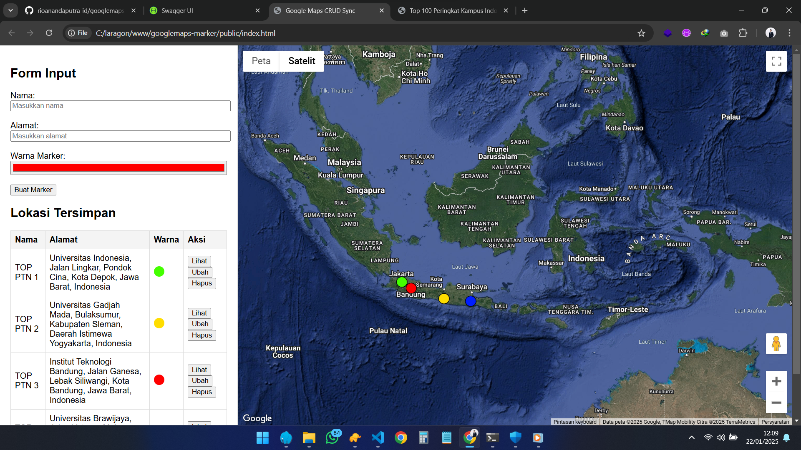
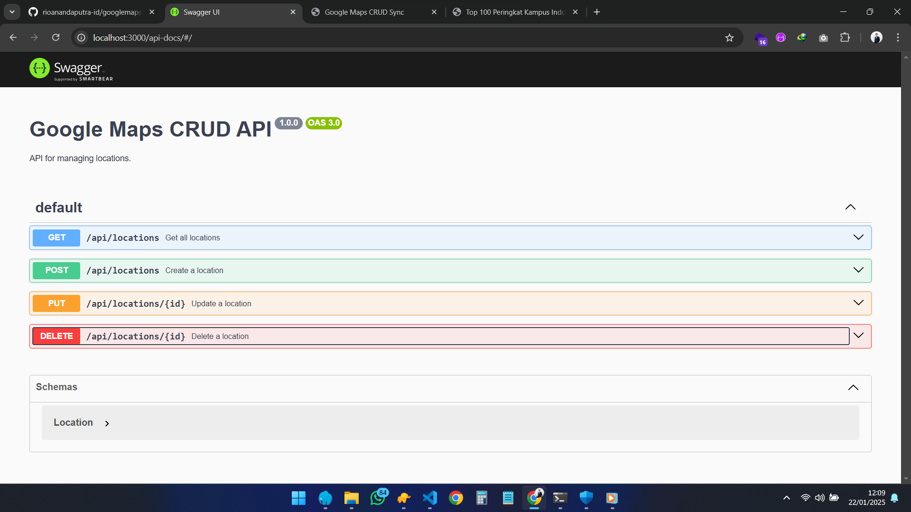

# Google Maps Markers

Proyek ini menyediakan layanan untuk mengelola penanda lokasi pada peta. Mendukung operasi CRUD (Create, Read, Update, Delete) dan telah terintegrasi dengan API Google Maps.

https://youtu.be/8FT-aKbQGHc?si=wNGuckhCdDUmXuz1




## Daftar Isi

- [Teknologi](#teknologi)
- [Instalasi](#instalasi)
- [Penggunaan](#penggunaan)
- [Endpoint API](#endpoint-api)
- [Variabel Lingkungan](#variabel-lingkungan)
- [Struktur Proyek](#struktur-proyek)
- [Lisensi](#lisensi)

## Teknologi

- Node.js
- Express.js
- Sequelize (ORM)
- PostgreSQL
- dotenv (untuk variabel lingkungan)
- Jest (untuk pengujian)
- Swagger (untuk dokumentasi API)

## Instalasi

1. Clone repository:
    ```sh
    git clone https://github.com/rioanandaputra-id/googlemaps-marker.git
    cd googlemaps-marker
    ```

2. Instal dependensi:
    ```sh
    npm install
    ```

3. Atur variabel lingkungan dengan membuat file `.env` di direktori root dengan konten berikut:
    ```env
    NODE_ENV=development
    NODE_PORT=3000
    DB_USERNAME=postgres
    DB_PASSWORD=postgres
    DB_NAME=markers_db_dev
    DB_HOST=127.0.0.1
    ```

4. Jalankan migrasi database:
    ```sh
    npx sequelize-cli db:migrate
    ```

## Penggunaan

Mulai server:
```sh
npm start
```

Mulai server dalam mode pengembangan:
```sh
npm run dev
```

Mulai server dalam mode pengujian:
```sh
npm run test
```

Proyek ini menggunakan Swagger untuk dokumentasi API. Untuk melihat dokumentasi API:
```
http://localhost:3000/api-docs
```

Untuk mengakses frontend:
```
http://localhost:3000
```

Catatan: Kunci API Google Maps yang digunakan di frontend adalah kunci demo, sehingga peta mungkin tidak berfungsi dengan benar saat diakses melalui Express.js karena referensi localhost. Buka secara langsung `index.html` klik kanan open with Chrome atau browser lainnya.
```
/googlemaps-marker/public/index.html
```

Perbaharui kunci API Google Maps:
```html
<script src="https://maps.googleapis.com/maps/api/js?key=API_KEY_GOOGLE_MAPS&libraries=places&callback=initMap" defer></script>
```

## Endpoint API

- `GET /markers`: Mengambil semua penanda
- `POST /markers`: Membuat penanda baru
- `GET /markers/:id`: Mengambil penanda berdasarkan ID
- `PUT /markers/:id`: Memperbarui penanda berdasarkan ID
- `DELETE /markers/:id`: Menghapus penanda berdasarkan ID

## Variabel Lingkungan

Variabel lingkungan berikut perlu diatur dalam file `.env`:

- `NODE_ENV`: Lingkungan di mana aplikasi berjalan (misalnya, development, production)
- `NODE_PORT`: Port di mana server akan berjalan
- `DB_USERNAME`: Nama pengguna database
- `DB_PASSWORD`: Kata sandi database
- `DB_NAME`: Nama database
- `DB_HOST`: Host database

## Struktur Proyek

- `src/`: Berisi kode sumber aplikasi
  - `models/`: Berisi model database
  - `controllers/`: Berisi controller untuk menangani permintaan
  - `routes/`: Berisi definisi rute
  - `migrations/`: Berisi file migrasi database

## Lisensi

Proyek ini dilisensikan di bawah Lisensi MIT. Lihat file [LICENSE](LICENSE) untuk detailnya.
